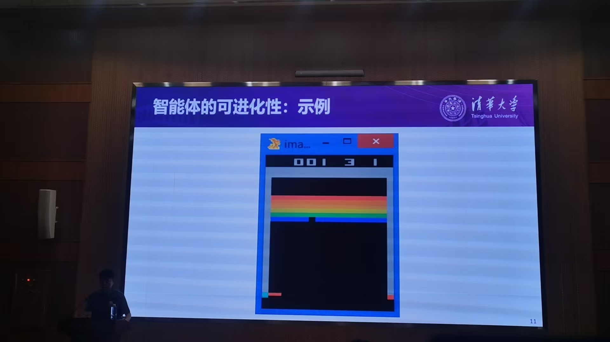
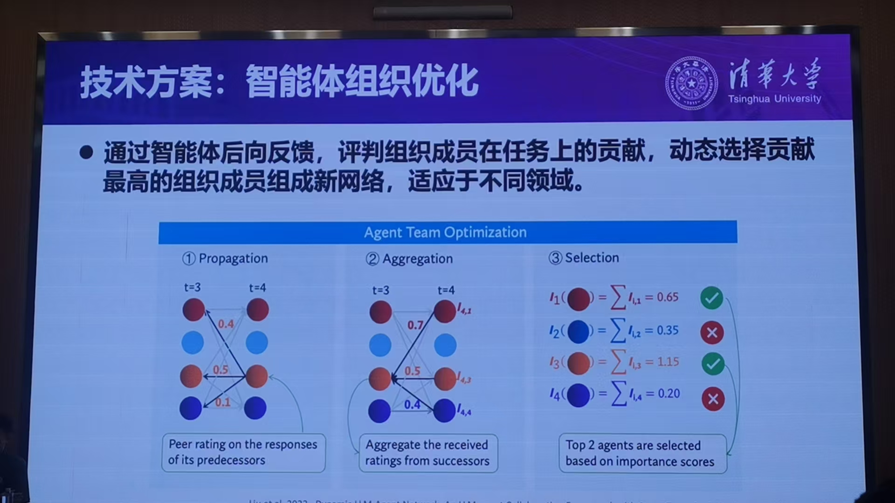
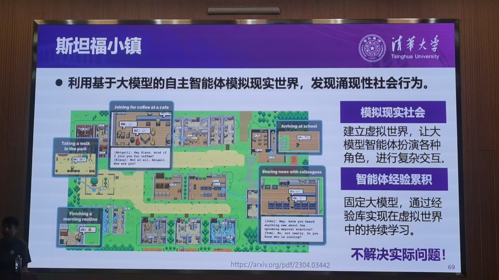

## 大模型驱动的可进化智能体-刘洋 清华大学

数据需求量远远大于数据增长量，人工智能需要进入到社会之中进行训练，

一个弹小球的例子

只了解规则→会接住球判断算→自主找到窍门规则（把球从一边打到上面自己弹）

4个基本问题：

### 1. 智能体进化的基本准则

没有三者都考虑的研究

### 2.单智能体“智商”进化

#### 错误反馈驱动的经验学习

错误反馈驱动的经验学习

让大模型同样从错误中积累经验

可学习可进化的智能体

部署经验库

经验的等级
high & low level
经验的更新

#### 2-2 基于自主数据标注的自我训练

ActRe 和ReAct的对偶关系 互补持续训练自我标注

### 3.单智能体“情商”进化

多轮经验

多智能体AI-发展群体社交技能 如聊八卦等

狼人杀的例子

结果 涌现出信任等社会行为

### 4. 多智能体“组织”进化

#### 4-1 智能体精英团队组建

#### 4-2 智能体医院

agent hospital

患者护士和医生均由AI扮演

合作式博弈

从模拟对话的突破

模拟医疗之外的实际应用价值

三维场景 虚拟形象

和可穿戴设备放一起

互动

用指南做参考

红色是增量

讲了一个应用到法官的例子

