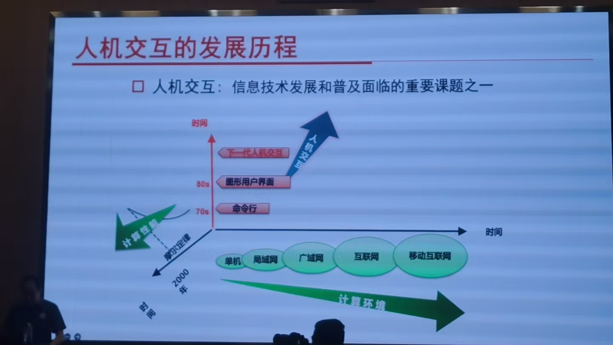
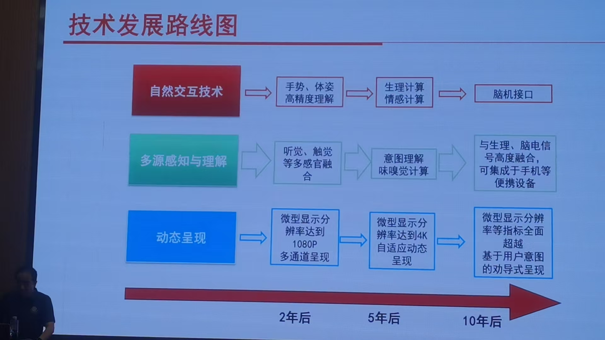
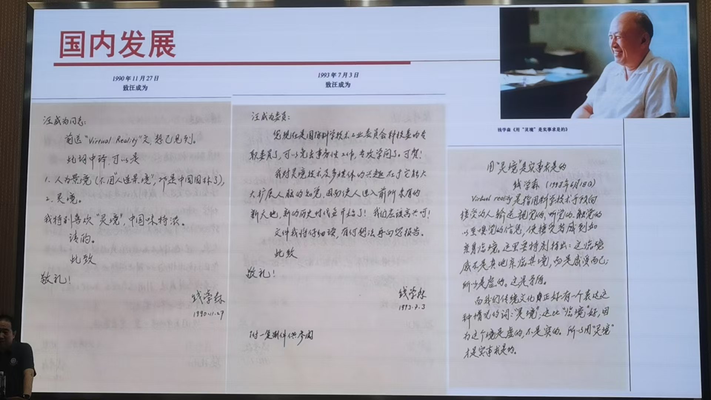
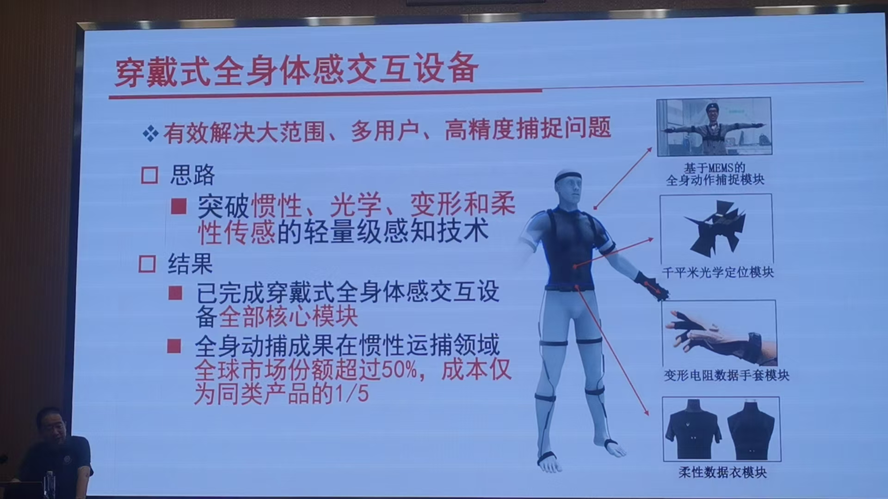
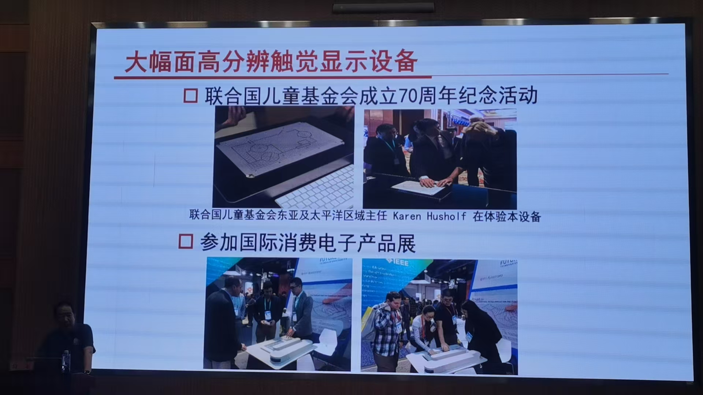
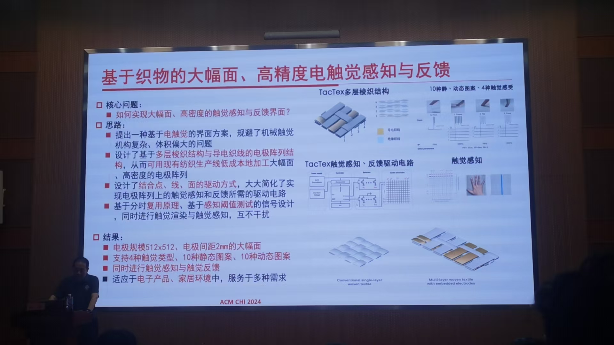
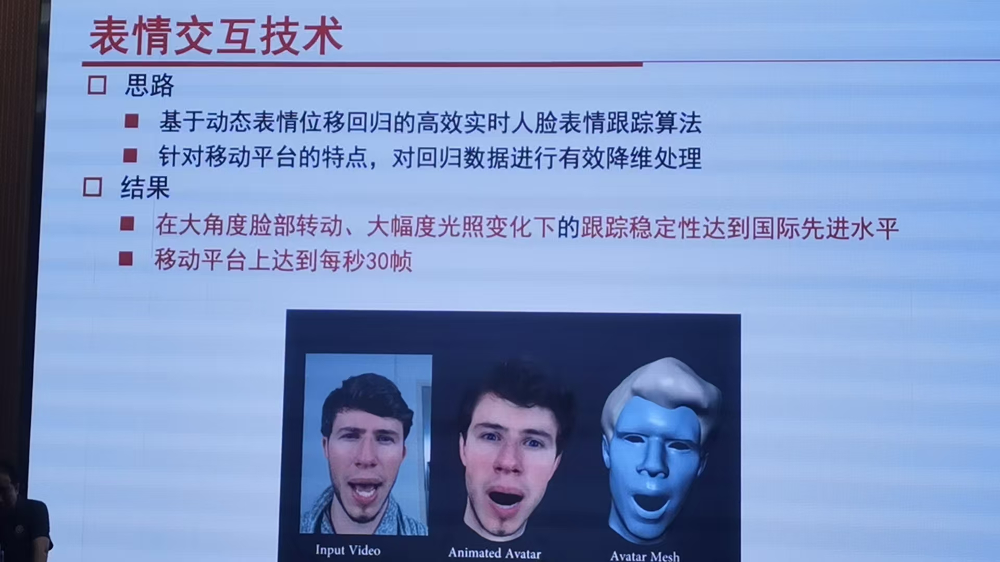
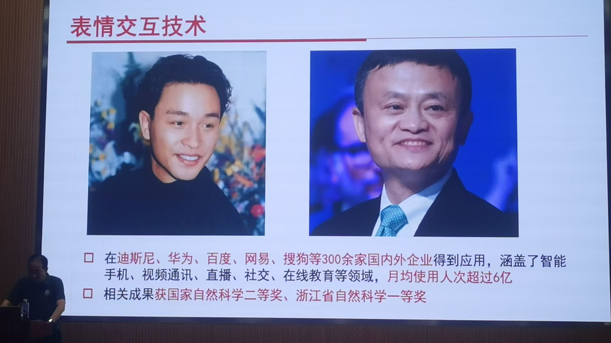
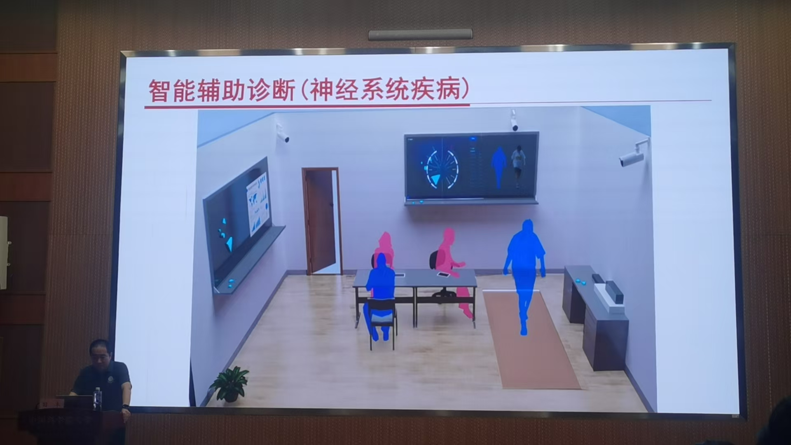
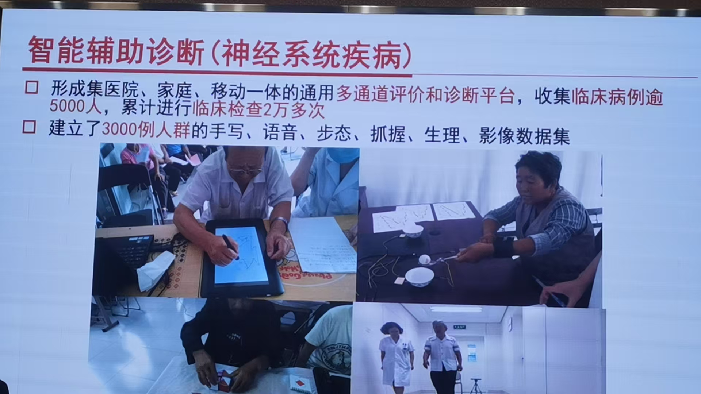

## 智能时代的人机交互 田丰

### 人机交互发展历程

从穿孔机到键盘命令行MOS  到图形化界面 到手机应用

右下角的文物

光笔交互系统

鼠标

键盘 pad方式

第一个个人电脑

kinect

leapmotion（针对手指等细节动作捕捉灵敏度大幅提升）

MYO（感知肌肉电信号，同时使用大型场景和细节手势传递）

野外通过手势控制无人设备，滑雪(等高难度动作时候可以同时控制拍照

GOOGLE Glass（室内导航等）

微软 Hololens

虚拟空间和真实空间叠加，复杂装备的远程协作

苹果 vision pro (真实世界也虚拟成电子信号)

三路发展

钱学森和人机交互

### 团队探索进展

代表性成果

1. 穿戴式

2.

给盲人

去博物馆 网上购置衣服

清华大学徐老师

计算机图形学

公式补充笔画

图形化结构和手写形态

骨传导耳机

和协和医院合作，帕金森病人，阿尔兹海默病人

### 未来发展方向

感觉是个各种项目的大综述 原来软件所可以做这么多应用，没有讲什么太深入的问题，只是讲了大概有什么
