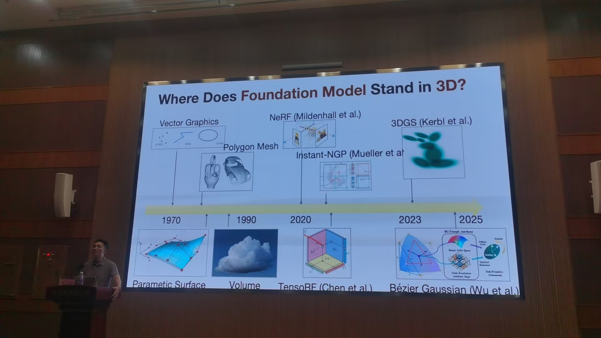
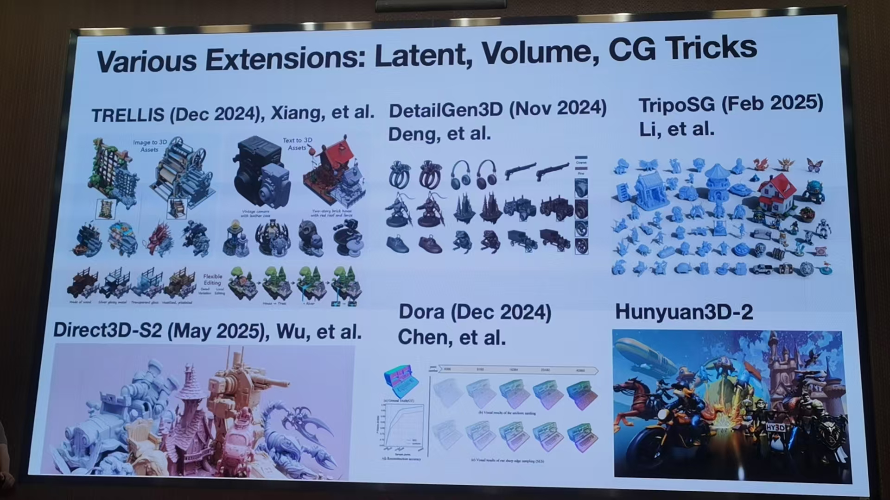
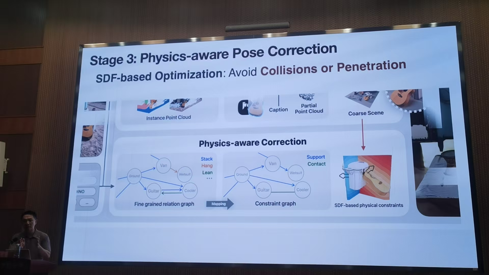

## From Newton to Latour -- Towards Physically and Socially Plausible 3D Generation

老师的故事

计算机图形学计算机视觉和成像一起结合

三部分 分而治之到合为一体

CNN 特征提取 图像编码器

3D表达发展历程

三维表达可以微分 每个点的概率

连续可微的表达 特征提取 

如何实现3D分割

用生成

表达 表达之间的对换 怎么实现表达间的对换

3D生成中的姿态（遮挡）等问题

物体间的关系

文本和3D无法对齐 语言模态和空间模态对齐

具身智能中场景的理解

真实世界非常messy

未来展望

