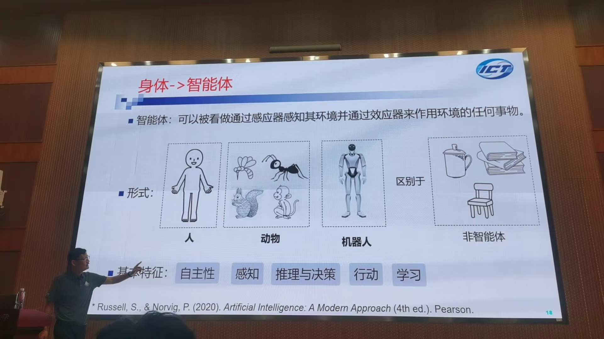
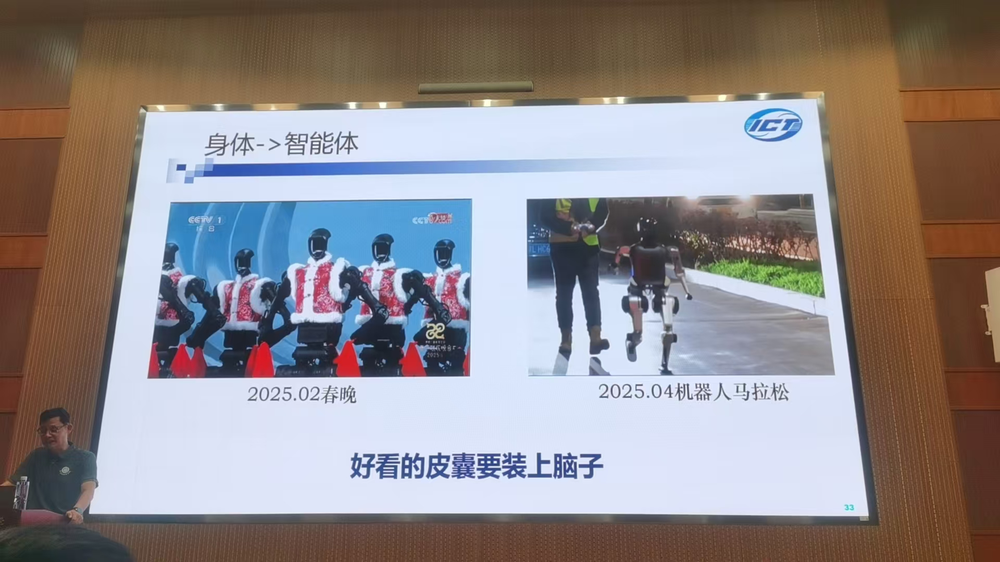
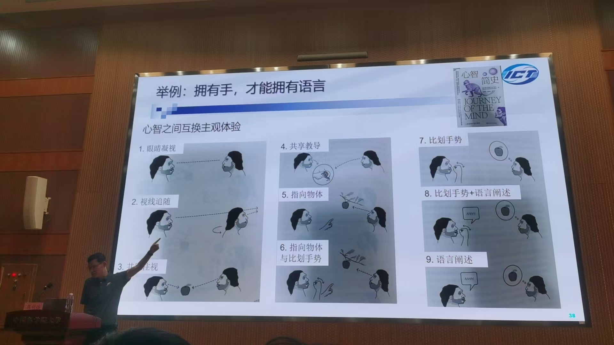

## 具身智能：内涵 技术 与发展 蒋树强

### Background

人工智能能否逼近人的智能

需要和各个产业紧密结合

### 具身智能的内涵

#### 具身智能定义

#### 智能体定义

身体的自适应性

小松鼠真可爱

（和具身智能有千丝万缕联系）

和身体紧密耦合

#### 类人具身智能体现

意识  情感

机器人是否可以算“一条命”

现阶段离不开冯诺依曼架构 图灵机 仅仅是“硅基的智能”，没有生命 

具身智能多任务性

橙底蓝字的话 不是单通道的

环境的关联性

（心领神会）语言和环境交互的强关联

### 具身智能技术（下面的五角星）

#### 具身感知

#### 具身行为

#### 具身问答

真实环境中（比如说在一个陌生房间中找一把雨伞）

#### 具身学习

#### 具身推理

快思考：黑盒的可解释性差的

慢思考：有一定自我意识的有推理过程的思考

#### 具身智能的发展

真实环境到虚拟环境到真实环境

视觉语言行为大模型

（身体非常重要 采集数据都不同）

小结是核心要点

