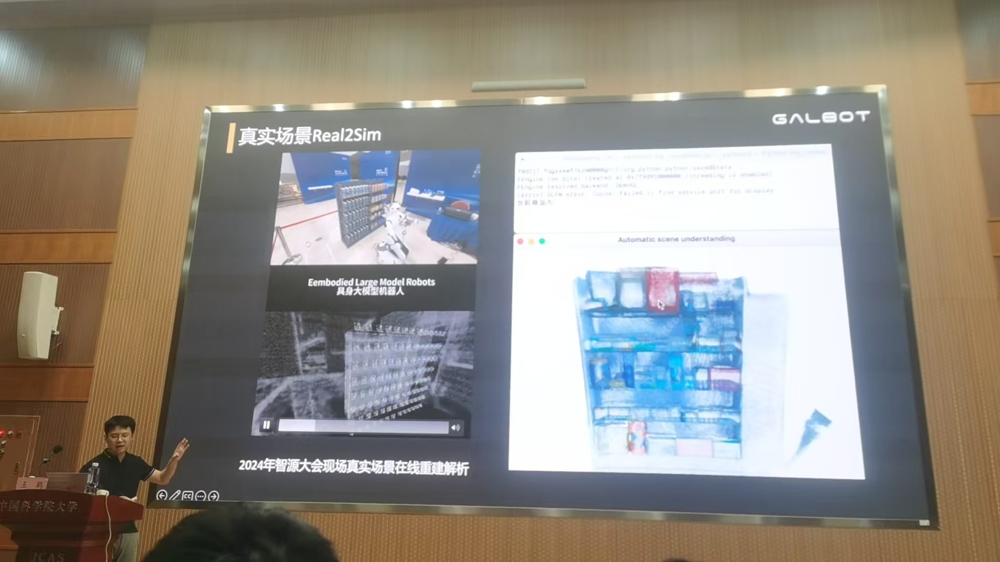
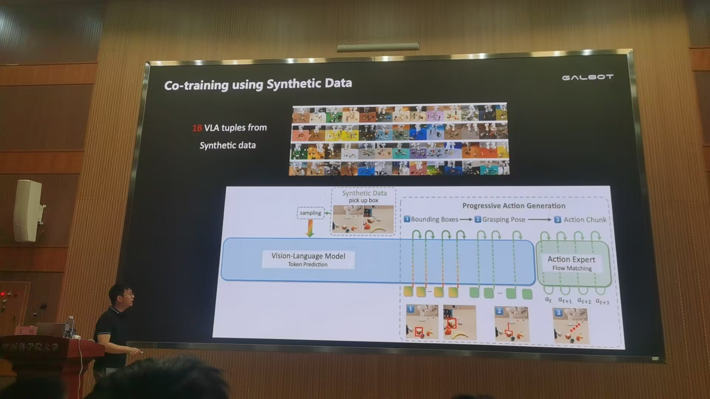
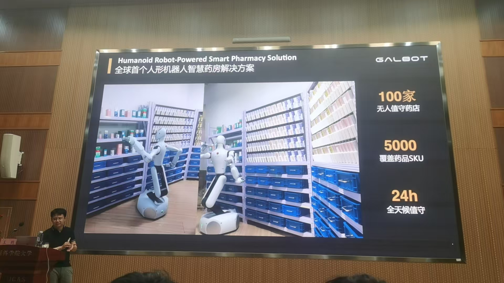

## 合成数据驱动的具身VLA 预训练新范式 王鹤

### 0. 预热 人形机器人浪潮

#### （一）雏形时代

最早人形机器人 1967年 日本 

1. 特斯拉人形机器人
2. 多模态大模型 

仅是基于数学模型，不是数据驱动

波士顿动力 

（仅是提前规划好的，路径已知）

传统控制方法

#### （二）运动时代

基于强化学习

本体感知

#### （三）生产力时代

（手眼脑的协调）

（1. 放到不同地方 一定程度上是多任务 2. 错误恢复 ）

放歪后可以调整 以视觉为信号输出全身的关节角→具身智能的体现

但也有局限性 ，只能完整分电池

### 具身端到端VLA大模型实现通用

LLM 听懂让拿瓶子

VLM 识别是瓶子 

能把指令转化成关节角 能够依赖具体身体结构 进行与环境的交互

自动驾驶 具身智能最大区别

人无法像开车一样开机器人（从而采数据）

人形机器人的数据采集 遥控操作员  数据量不够 目前具身智能最大的痛点 没有数据集 每个机器人身体都不同 差异化太大

现在都是先用人纯模拟操作计算机的指定动作然后进行训练

解决→用语言描述

用计算机图形学 物理渲染解决，虚拟世界仿真

桌面数据集 

3D重建 

抓取大数据 连续视觉输入

因为有充分量的数据

（互联网混合训练）

200个 一人半天（VS 特斯拉 10万次）成本↓

（没有过拟合 很好泛化到农夫山泉和东方树叶 （4列到3列 不同颜色形状数量））

（行为数据中（A）只能看出流程 不知道具体怎么做）

动作数据 纯粹模仿

用合成数据叠衣服

局部商业化

每个能力都需要大量数据学习 仿真数据可以解决，互联网更加通用
