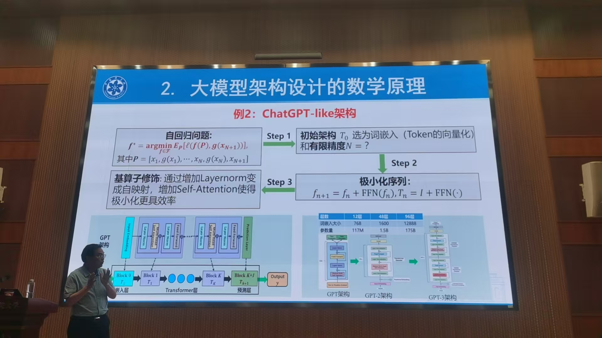
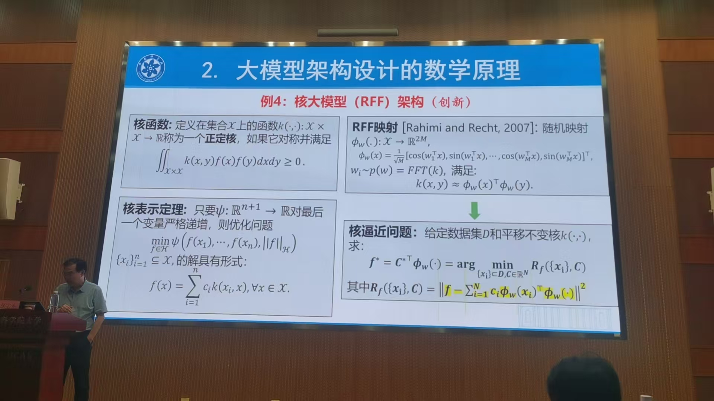

## AI：无限维问题VS有限维技术——浅析大模型架构的设计基础与评估原理 徐宗本

现有评估方法——测试；什么架构承载，架构设计，怎样做；评价AI技术需要回到无限维 方法论

### 一、智能问题：本质上的无限维VS技术上的有限维

人工智能：对于可观测的现实世界规律做总结。可观测+现实世界

观测到的规律为数据（时间+空间）；数据建模

多模态（多个观测角度数据）

#### 1.机器学习问题

#### 2.数据生成和传输问题

#### 3.方法论学习

#### 4. 具身智能

架构和评测部分

### 二、如何设计有限维AI系统？架构设计的数学基础

主要聚焦架构设计

含有很多参数的函数

逼近论解决 定义？仅浅层架构设计问题

深层架构？

(马尔可夫性质)

初始架构 极限架构 可行架构

定义在函数空间上的算子

性能稳定

不动点集上趋向于1

深度架构设计问题是一个算子族的公共不动点存在问题

怎么判断无穷架构是否存在？

伸缩是有限度的（算子的基本性质）

拓扑无关量

线性谱半径

总结：

1. 逼近论只解决浅层架构
2. 深度架构设计问题是一个算子族的公共不动点存在问题
3. 真正可用的架构：伸缩性不能大于1；在不动点处趋于饱和
4. 基于极小化序列修饰形成架构

### 三、评估AI系统必须回到无限维：极限理论

智能是由有限知识走向无限知识所引起的认知改变。

极限是开拓认知边界的工具。

### 结语

要崩溃了 好困好累

